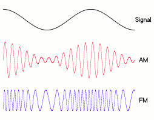
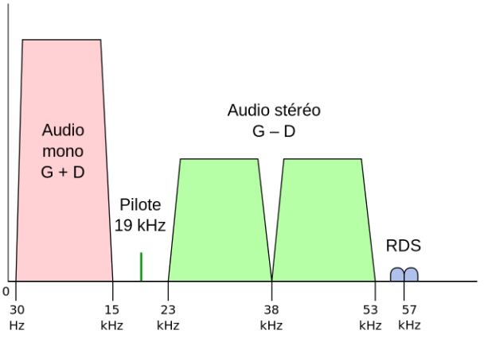
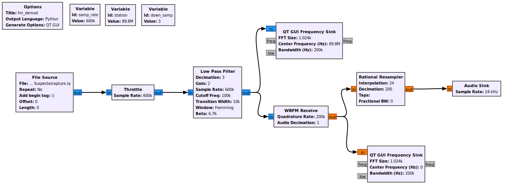
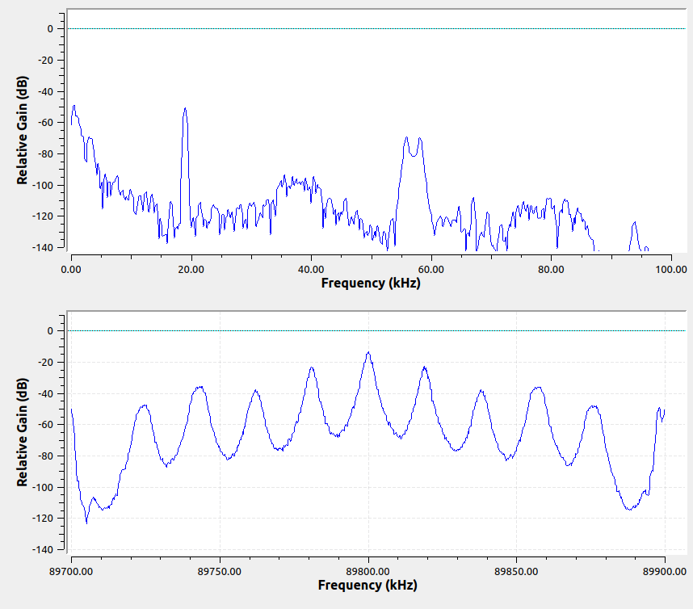
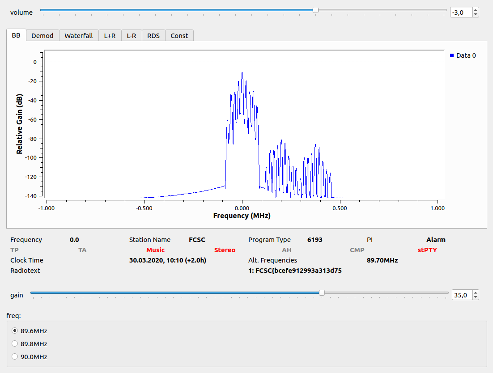

Finale FCSC 2020 - RaDio Suspecte (writeup)
===========================================
*(shd33)*

Avertissement : Je suis un débutant en radio. J'ai des notions de physique et j'ai passé mon lundi aprem à me documenter sur la FM, mais je ne garantis pas le bon usage des termes techniques dans ce writeup...

Analyse de départ
-----------------

Je commence par ouvrir la capture radio dans GNU radio pour regarder le spectre, histoire d'avoir une idée de ce qui m'attend. Il semblerait que l'on ait bien affaire à une radio FM. La fréquence d'échantillonage de 600kHz permet d'avoir une visibilité sur 3 bandes des fréquences FM : 89.6MHz, 89.8MHz et 90.0MHz.

Cela dit, le sujet semble donner peu d'informations, à part une histoire sur les châteaux d'Allemagne de l'Est... Cependant le titre est intriguant : les majuscules forment le sigle RDS. Après une recherche sur wiki, je comprends que cela ne peut être dû au hasard.

Radio Data System
-----------------

Le RDS est une technologie permettant à une antenne radio FM de transmettre une multitude de métadonnées associées à une station radio. Typiquement, c'est ce qui permet l'affichage du nom de la station, du titre en cours d'écoute, d'indiquer l'heure, de signaler à une autoradio la diffusion d'une info trafic, ou même d'assurer le changement fluide d'une fréquence à une autre quand on veut écouter la même station en parcourant plusieurs régions...  
L'ancêtre de la RDS, l'ARI, a d'ailleurs été lancé initialement en Allemagne en 1974, ce qui explique (peut-être l'histoire de châteaux allemands).

Je suis alors convaincu que le flag se trouve quelque part dans les données RDS. *(Spoiler : c'était le cas :P)*

L'article wiki explique comment le signal RDS est modulé, ainsi que le protocole + codes correcteurs d'erreurs utilisés.
Cela dit, je ne comprends alors rien, car je n'y connais rien du tout en transmission radio.

Crashcourse : la radio FM
-------------------------

Pour pouvoir être transmis, un signal radio a besoin d'être modulé. Modulé, ça veut dire être intégré à un autre signal appelé "porteuse" (de fréquence beaucoup plus élevée). Lorsqu'un poste réçoit un signal radio, il le démodule avant de restituer le signal initial.

Il y a plusieurs moyens de moduler un signal. Les plus courants sont l'AM (Amplitude Modulation) et la FM (Frequency Modulation). Ci-dessous l'illustration de wiki, qui vaut 1000 mots :

Je passe les détails techniques et équations de modulation/démodulation, ainsi que ceux concernant le format `.iq`. GNU Radio permet de faire tout ça à peu près automatiquement.

Une fois démodulé, un signal radio FM ressemble à ceci :

- En rouge, le signal mono qui est directement dans les fréquences audibles.
- Ensuite un signal pilote à 19Hz qui sert à indiquer la présence de la stéréo.
- Puis un signal stéréo (en fait la différence Gauche - Droite, qui permet de calculer G et D à partir de G+D).
- Et enfin le RDS !!

La forme "double" des signaux stéréo et RDS est due au fait que ceux-ci sont ici déjà modulés (au total, il sont donc modulés 2 fois !). La modulation utilisée est dite [DSB-SC](https://en.wikipedia.org/wiki/Double-sideband_suppressed-carrier_transmission) : en gros c'est ce qui duplique le signal symétriquement par rapport à la sous-porteuse, qui quant à elle est supprimée.
La sous-porteuse stéréo est à 2\*19Hz et celle de la RDS à 3\*19Hz (harmoniques du pilote).

Pour récupérer les informations transmises par RDS, il faut alors filtrer, démoduler à nouveau (en amplitude cette fois) puis analyser le binaire.

Revenons à notre signal
-----------------------

La fréquence 89.8MHz de l'énoncé correspond à la porteuse du signal radio mesuré. Pour ce qui se demanderaient comment ça se fait que la fréquence d'échantillonage soit largement inférieure à la fréquence du signal mesuré, voir le début de ce [writeup](https://github.com/tchup-dev/FCSC-2020/blob/master/ble.md) de BLE qui parle d'hétérodynage et de format IQ.  
Ce qu'il faut retenir : on a un spectre translaté où la fréquence captée 89.8MHz est centrée en 0.

Il faut donc commencer par appliquer un filtre pour ne garder que la bande de fréquences qui nous intéresse (-100kHz à +100kHz en radio FM), et on peut démoduler.
J'ai fait ça avec le graphe GNU Radio suivant (fichiers dans le git) :

Une musique baroque passe en fond (j'ai mis un `Audio sink`) : la démodulation a fonctionné :)  
Côté spectres, on obtient ceci :

On retrouve un magnifique signal RDS, symétrique et centré en 57kHz, comme attendu !

Le RDS, c'est compliqué
-----------------------

Maintenant que l'on sait démoduler, et que l'on a confirmation qu'un signal RDS accompagne bien la station radio captée, il faut extraire le flag.
Et ce n'est pas simple, car une fois obtenues les blocs binaires bruts, il faut en extraire l'information. Heureusement pour nous, il existe un module GNU Radio qui se charge exactement de ça : `gt-rds` (j'ai pu l'installer directement avec apt).
Sur le github de gt-rds se trouve même des graphes GNU Radio d'exemple.
J'ai utilisé le graphe `rds_rx.grc` qui j'ai légèrement modifié (source, échantillonage, translation des fréquences).
Je l'ai mis en pj dans ce repo (`rs_decode.grc`).

Chaque station captée émet un tiers du flag dans le canal "fréquences alternatives".
Voici pour le premier morceau :

Conclusion
----------

J'ai appris plein de trucs, à la fois sur la transmission FM, mais aussi sur l'utilisation de GNU Radio. Bref, c'était cool :)

J'espère que ce writeup était assez clair, mais n'hésitez pas à poser des questions si ce n'est pas le cas !